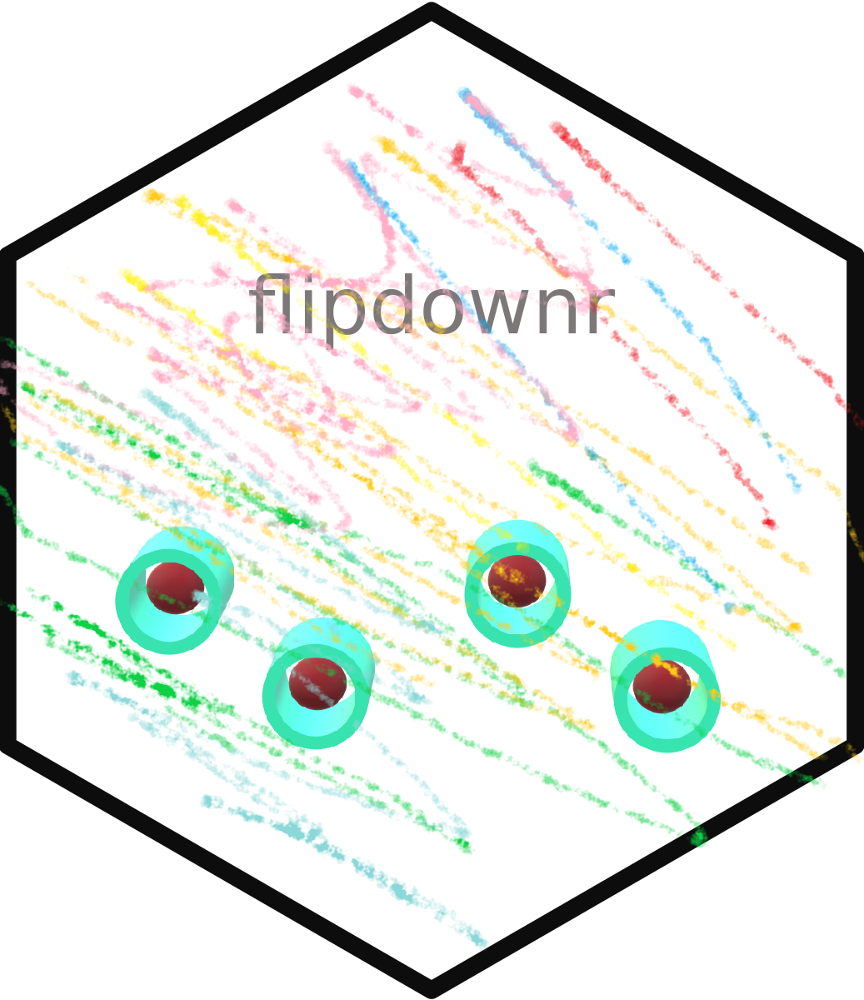
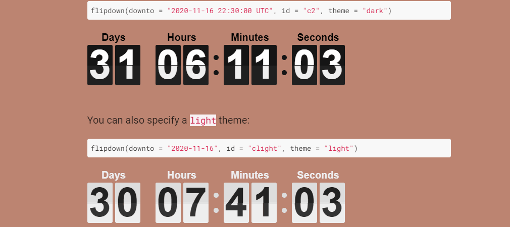

<!-- README.md is generated from README.Rmd. Please edit that file -->

```{r, include = FALSE}
knitr::opts_chunk$set(
  collapse = TRUE,
  comment = "#>",
  fig.path = "man/figures/README-",
  out.width = "100%"
)
```

# flipdownr <a></a>

<!-- badges: start -->
[](https://cran.r-project.org/package=flipdownr)
[](https://cran.r-project.org/package=flipdownr)
[](https://cran.r-project.org/package=flipdownr)
[](https://cran.r-project.org/package=flipdownr)
[](https://choosealicense.com/licenses/mit/)
[](https://github.com/feddelegrand7/flipdownr)
<!-- badges: end -->

The goal of flipdownr is to create a Countdown object within your RMarkdown documents and Shiny application. `flipdownr` is an R wrapper of the JavaScript library [flipdown](https://pbutcher.uk/flipdown/)

<br>



## Installation

You can install `flipdownr` from CRAN with: 

```{r, eval=FALSE}

install.packages("flipdownr")

```

## Functions and Arguments

+ `flipdownr` has one function: `flipdown` which contains the following arguments: 

+ `downto`: the targeted date for the countdown. It must have the form of 'yyyy-mm-dd' or 'yyyy-mm-dd hh:mm:ss`. Note that you can include the time zone (example UTC): 'yyyy-mm-dd hh:mm:ss UTC';

+ `id`: the id of the countdown. Useful when you need to include many countdown objects in one document;

+ `theme`: The theme of the flipdown object. Two possible choices: 'dark' or 'light'. Defaults to 'dark'

+ `headings`: A character vector pecifying the heading related to each time part. Defaults to English headings: c("Days", "Hours", "Minutes", "Seconds").


## Examples 

A demo is available [here](https://ihaddadenfodil.com/post/introducing-the-flipdownr-package-create-a-countdown-in-rmarkdown-documents-and-shiny-apps/)


## Code of Conduct

Please note that the flipdownr project is released with a [Contributor Code of Conduct](https://contributor-covenant.org/version/2/0/CODE_OF_CONDUCT.html). By contributing to this project, you agree to abide by its terms.


